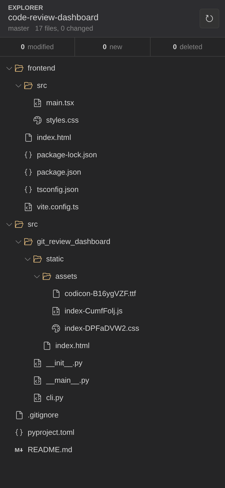
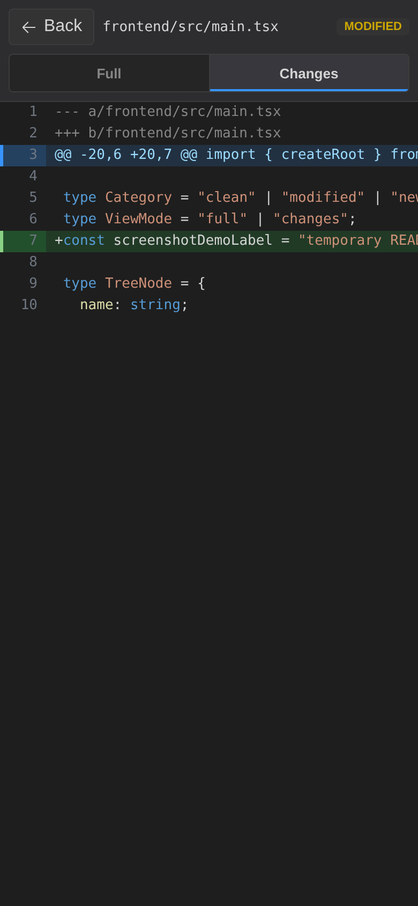

# 🔎 Code Review Dashboard

A small read-only web dashboard for browsing a Git repository and reviewing uncommitted changes from a phone or tablet.

<table>
  <tr>
    <td></td>
    <td></td>
  </tr>
  <tr>
    <td align="center">Repository explorer</td>
    <td align="center">Changes-only file review</td>
  </tr>
</table>

## Install

From this directory:

```bash
pip install .
```

For isolated global use:

```bash
pipx install .
```

## Run

Launch it from any folder inside a Git repository:

```bash
git-review-dashboard --host 0.0.0.0 --port 8765
```

Then open `http://<machine-ip>:8765` from another device on the same private network or VPN.

The app is strictly read-only. It shows a repository file tree, color-codes changed/new/deleted files and folders, and runs read-only Git commands such as `git status`, `git diff`, `git show`, `git ls-files`, and `git rev-parse`.

## Frontend Development

The browser UI is a Vite/React/TypeScript app in `frontend/`. The production build is written into `src/git_review_dashboard/static/` so the Python package can serve it without a separate Node process.

```bash
cd frontend
npm install
npm run build
```

## Options

```bash
git-review-dashboard --help
```

- `--repo PATH`: repository or subdirectory to inspect, defaults to the current directory.
- `--host HOST`: bind host, defaults to `0.0.0.0`.
- `--port PORT`: bind port, defaults to `8765`.
- `--no-open`: do not open a local browser automatically.
